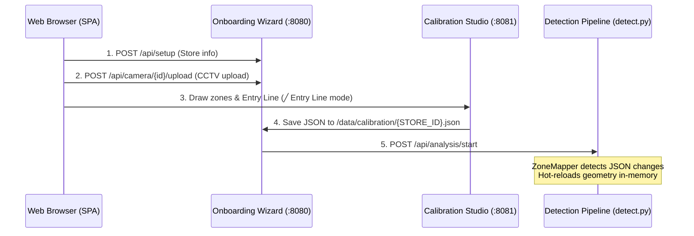

# Store Intelligence — System Design

## Overview

Store Intelligence converts raw CCTV footage into a live retail analytics platform. The system is built across four tightly-coupled stages — detection, event stream, intelligence API, and live dashboard — with a fifth layer: a browser-based onboarding wizard that makes the entire pipeline zero-configuration from a clean start.

Store Intelligence is designed as a **fully dynamic, runtime-adaptive analytics platform**. Rather than compiling configurations, hardcoding mapping tables, or requiring manual container/service restarts when adding cameras or changing layout parameters, the entire system resolves all constraints dynamically. The onboarding wizard allows configuring stores, camera counts, role definitions, and video clips live. The calibration studio writes shapes directly to `/data/calibration/{STORE_ID}.json`, which the pipeline's `ZoneMapper` watches and hot-reloads dynamically in real time without dropping camera streams.

**North-star metric: Offline Store Conversion Rate = Visitors who purchased ÷ Total unique visitors**

Every architectural decision connects back to this number.

---

## System Architecture

```
┌─────────────────────────────────────────────────────────┐
│               BROWSER — http://localhost:8080            │
│                                                         │
│  ┌──────────────────────────────────────────────────┐   │
│  │  Onboarding Wizard  (wizard.html)                │   │
│  │  Step 1: Store Setup    Step 2: Add Cameras      │   │
│  │  Step 3: Zone Config    Step 4: Start Analysis   │   │
│  └──────────────────────────────────────────────────┘   │
│                    │ POST /api/*                         │
│                    ▼                                     │
│  ┌──────────────────────────────────────────────────┐   │
│  │  Live Dashboard (wizard.html — same SPA)         │   │
│  │  WebSocket ← annotated JPEG frames               │   │
│  │  WebSocket ← structured event feed               │   │
│  │  Metrics: visitors, queue depth, event log       │   │
│  └──────────────────────────────────────────────────┘   │
└─────────────────────────────────────────────────────────┘
         │ POST /api/analysis/start
         ▼
┌─────────────────────────────────────────────────────────┐
│      DETECTION LAYER  (store_detection_pipeline)        │
│                                                         │
│  CameraProcessor × N  (one thread per camera)           │
│  ┌────────────┐   ┌───────────────────────────────┐    │
│  │ YOLODetect │──▶│  VisitorIdentityManager        │    │
│  │ YOLO11m    │   │  8-signal consensus Re-ID      │    │
│  │ ByteTrack  │   │  ghost + shadow track recovery │    │
│  └────────────┘   └───────────────────────────────┘    │
│       │                       │                         │
│  ┌────▼───────┐   ┌───────────▼───────────────────┐    │
│  │StaffTracker│   │  Zone / Entry / Queue modules  │    │
│  │ HSV + zone │   │  ZoneDwellTracker (30s emit)   │    │
│  │ rule       │   │  EntryExitDetector (line cross) │   │
│  └────────────┘   │  QueueTracker (billing area)   │    │
│                   └───────────────────────────────┘    │
│                              │                          │
│                   ┌──────────▼──────────┐              │
│                   │   EventEmitter       │              │
│                   │  events.jsonl (disk) │              │
│                   │  WebSocket broadcast │              │
│                   └──────────┬──────────┘              │
└──────────────────────────────┼──────────────────────────┘
                               │
              ┌────────────────┴───────────────┐
              │                                │
              ▼                                ▼
┌─────────────────────────┐   ┌───────────────────────────┐
│  Intelligence API        │   │  GUI Server               │
│  store_intelligence_api  │   │  (pipeline container)     │
│  :8000                  │   │  :8080                    │
│                         │   │                           │
│  POST /events/ingest    │   │  WebSocket /ws/frames     │
│  GET  /metrics          │   │  WebSocket /ws/events     │
│  GET  /funnel           │   │  REST   /api/*  (wizard)  │
│  GET  /heatmap          │   │  REST   /docs   (Swagger) │
│  GET  /anomalies        │   └───────────────────────────┘
│  GET  /health           │
│  POST /replay           │   ┌───────────────────────────┐
│  GET  /audit/{vid}      │   │  Zone Calibration Studio  │
└─────────────────────────┘   │  store_zone_calibrator    │
                               │  :8081                    │
                               │  Draw polygons on frames  │
                               │  Save → calibration JSON  │
                               └───────────────────────────┘
```

---

## End-to-End Pipeline & Workflow Detail

This section traces the path of raw pixels and events through our five-stage, zero-configuration pipeline. It illustrates how the system converts unorganized CCTV clips and POS transactions into clean, actionable retail metrics while satisfying the requirements of the challenge.

### 1. Dynamic Setup & Stream Initialization (Zero-Config Onboarding)
The lifecycle begins when the user accesses the Onboarding Wizard SPA at `http://localhost:8080`.
* **State Registration:** The user enters the store name and code. The backend writes this information to `/data/si_session/session.json`, establishing a unique `STORE_ID` (e.g., `ST_ANDHERI`).
* **Slot Provisioning:** As CCTV clips are uploaded, the backend dynamically registers camera slots (e.g., `CAM_ENTRY_01`, `CAM_BILLING_01`, `CAM_FLOOR_01`). It extracts preview frames from the first frame of each video.
* **Dynamic Calibration:** The user launches the Calibration Studio (`:8081`). Using the canvas overlay, they draw polygon shapes representing regions (`zone`, `queue_area`, `staff_area`) and a two-point line vector (`entry_line`). On save, the coordinates are written to `/data/calibration/{STORE_ID}.json`. The pipeline's `ZoneMapper` watches this directory and instantly hot-reloads these configuration files without needing a service restart.



### 2. Deep Vision & Multi-Signal Tracking (Detection Layer)
When the analysis is triggered, the background daemon invokes `run_pipeline()`, spinning up a `CameraProcessor` thread for each camera.
* **Inference & Bounding Boxes:** Frames are read from the video files. The processor passes each frame to YOLO11m to detect the `person` class. Bounding boxes are handed to ByteTrack to manage frame-to-frame association.
* **Visitor Identity Manager:** To solve the core retail problem—frequent occlusion behind tall displays and track fragmentation—the `VisitorIdentityManager` aggregates local tracks into a persistent, global `visitor_id` using a custom **8-Signal Consensus Re-ID** algorithm. The engine scores spatial proximity, Kalman trajectory predictions, velocity shadow tracks, temporal gaps, and HSV appearance histograms to resolve identity matches in real time.
* **Staff Filtering:** Crops of the bounding boxes are evaluated by the `StaffTracker` using HSV black-clothing detection and checked against designated `staff_area` polygons. If a track's centroid falls inside a staff zone, or black clothing is consistently detected across frames, the visitor is classified with `is_staff = true` to prevent cashier tracks from corrupting customer statistics.
* **Line-Crossing & Zone Occupancy:** Centroids are mapped against the normalized calibration coordinates:
  - Crossing the calibrated two-point `entry_line` triggers `ENTRY` / `EXIT` events based on half-plane math.
  - Occupying a `zone` polygon registers a `ZONE_ENTER` event, accumulates dwell time, and triggers `ZONE_DWELL` every 30 seconds.
  - Entering a `queue_area` (or `billing_counter` shape) logs a `BILLING_QUEUE_JOIN` event, incrementing the live queue depth count.

### 3. Structured Event Generation & Stream
As the detection layer identifies actions, it formats them into structured events.
* **Confidence Lineage:** Each event carries a `confidence` field calculated using a mathematical lineage:
  $$\text{final\_confidence} = \text{det\_conf} \times \text{track\_conf} \times \text{reid\_conf} \times \text{zone\_conf}$$
  This captures accuracy at every stage (detection precision, tracking overlap, Re-ID consensus strength, and zone intersection confidence).
* **Line-Buffered Serialization:** The `EventEmitter` assigns a unique event UUID-v4, verifies schema constraints, and writes the event as a JSON line to `events.jsonl` on disk. Simultaneously, it sends the event to the GUI server's WebSocket queue and POSTs the batch to the Intelligence API.

### 4. Real-time API Ingestion & Sessionization
The Intelligence API (`:8000`) ingests events in batches.
* **Idempotency & Type Validation:** The FastAPI endpoint uses strict Pydantic models to validate type safety. An in-memory index (`EventStore._seen_ids`) ensures that duplicate event IDs are suppressed, returning `duplicates = 1`.
* **Visitor State Machine (FSM):** Events are sessionized in the `SessionStore`. A per-visitor state machine tracks the customer's lifecycle (`ENTERED → BROWSING → DWELLING → QUEUEING → EXITED`). A `REENTRY` event reopens an existing visitor's session rather than creating a new one, keeping unique visitor counts accurate.
* **Sliding Window POS Correlation:** The API parses POS transaction files (supporting standard and Purplle production schemas). The `CorrelationEngine` correlates billing-queue dwells with POS records: a session is marked converted if the visitor was in the queue within a 5-minute window preceding a POS transaction timestamp.
* **Verifier & Anomaly Engine:** Ingested events are continuously checked by the `VerifierEngine` for integrity violations (e.g., negative queue depths, fast re-entries, or drastic confidence drops). Violations trigger warning metrics.

### 5. Live Dashboard & Analytical Projections
The user monitors store performance on the live single-page dashboard.
* **Real-time Streaming:** The GUI server broadcasts base64 JPEGs and JSON events over WebSockets. The dashboard updates live image tags, appends logs, and increments active metrics.
* **Dynamic Projections:** Business analysts hit the query endpoints, which compute metrics on-demand from the in-memory session registry:
  - `GET /metrics` -> Calculates conversion rate, visitor counts, queue metrics, and abandonment rates.
  - `GET /funnel` -> Measures conversion progress (Entry -> Browsing -> Queue -> Purchase) and drop-offs.
  - `GET /heatmap` -> Maps spatial visitation counts and dwell averages across calibrated zones.
  - `GET /anomalies` -> Identifies queue spikes, conversion dips, dead zones, and integrity alerts.

---

## Stage 0 — Onboarding Wizard

**Files:** `pipeline/wizard.html`, `pipeline/wizard_backend.py`, `pipeline/gui_server.py`

The wizard is a single-page application served by the pipeline container. It replaces the need for any manual environment variable setup, CLI flags, or configuration files.

### Session Lifecycle

1. **`POST /api/setup`** — Stores store name, store code, and auto-derives `STORE_ID = ST_{store_code}`
2. **`POST /api/camera/add`** — Adds a typed camera slot (`entry` → `CAM_ENTRY_01`, `billing` → `CAM_BILLING_01`, `floor` → `CAM_FLOOR_01`, `godown` → `CAM_GODOWN_01`). IDs are assigned sequentially and deterministically.
3. **`POST /api/camera/{slot_id}/upload`** — Accepts a multipart video upload. File is written to `/data/si_session/{slot_id}/{filename}`. First frame is extracted and previewed via `GET /api/camera/{slot_id}/frame`.
4. **`GET /api/calibration/url/{slot_id}`** — Returns the calibration studio URL for a camera slot, passing `camera_id` as a query parameter.
5. **`POST /api/analysis/start`** — Spawns `run_pipeline()` in a background daemon thread. Sets `STORE_ID` env var before launch so `zone_mapper` picks up the calibration JSON. The wizard transitions to Live Dashboard mode automatically.
6. **`GET /api/analysis/status`** — Polled by the SPA to detect pipeline completion or errors.

Session state is persisted to `/data/si_session/session.json` after every mutation. This means the calibration studio (running in the same container) can read the session and know which cameras and store are active.

---

## Stage 1 — Detection Layer

**Files:** `pipeline/detect.py`, `pipeline/tracker.py`, `pipeline/staff.py`, `pipeline/entry_exit.py`, `pipeline/billing_queue.py`, `pipeline/zones.py`, `pipeline/zone_mapper.py`, `pipeline/memory.py`, `pipeline/behavior.py`

### Orchestration (`detect.py`)

`run_pipeline()` is called with a `camera_file_map` (camera_id → video path), `camera_role_map`, and `adjacency_map`. It:
1. Creates a shared `VisitorIdentityManager` and `BehaviorStateMachine` — shared across all cameras to enable cross-camera Re-ID.
2. Instantiates one `CameraProcessor` per camera in a `ThreadPoolExecutor`.
3. Each processor runs `process_video()` → frame loop → `process_frame()` → annotate → push to GUI server.

**Wizard mode:** When `camera_file_map` is empty (no store configured), `detect.py` skips `run_pipeline()` entirely and starts only the GUI server in wizard mode. This is what happens on `./run.sh` before any store is set up.

### Person Detection

- **Model:** YOLO11m from `ultralytics`, class filter: `person` only (class 0)
- **Tracker:** ByteTrack (`tracker="bytetrack.yaml"`) — IoU + motion-based, no appearance model at the tracker level
- **Threshold:** `conf=0.35` minimum; low-confidence detections are **emitted with their real confidence**, never silently dropped
- **GPU/CPU:** Detected at startup; `ultralytics` handles device selection. MOG2 background subtraction is the fallback when `ultralytics` is unavailable.
- **Processing:** Every 3rd annotated frame is pushed to the WebSocket to stay within bandwidth limits while keeping latency below 200ms on CPU.

### Visitor Identity Manager — 8-Signal Consensus Re-ID (`tracker.py`)

The central identity challenge in retail CCTV: the same person disappears behind a shelf and reappears 10 seconds later. ByteTrack assigns a new track ID. The `VisitorIdentityManager` maps track IDs to persistent `visitor_id` tokens using an 8-signal vote:

| Signal | Description | Weight |
|---|---|---|
| Spatial proximity | Centroid distance vs. expected trajectory | High |
| Appearance embedding | HSV colour histogram cosine similarity | Medium |
| Trajectory score | Kalman-predicted position match | High |
| Zone continuity | Same zone as last known position | Medium |
| Temporal plausibility | Time gap within expected re-appearance window | High |
| Camera handoff | Track lost in one camera's FOV, gained in adjacent | Medium |
| Ghost track (Kalman) | Predicted position when track is temporarily lost | High |
| Shadow track (velocity) | Velocity-extrapolated position for fast movers | Low |

A new association is accepted only when the consensus score crosses a per-store calibrated threshold (managed by `CalibrationEngine`). Below threshold, a new `visitor_id` is minted.

**Memory Manager (`memory.py`):** Stores the last-seen embedding, centroid, zone, and speed per visitor. Ghost tracks use Kalman filter prediction. Shadow tracks use linear velocity extrapolation. Both decay confidence over frames, preventing false associations across long gaps.

### Staff Classification (`staff.py`)

Two-signal approach:
1. **HSV black-clothing detection:** Crop the bounding box, convert to HSV, compute pixel fraction with H∈[0,180], S∈[0,80], V∈[0,80] (black region). Threshold: >30% of crop is black → candidate staff.
2. **Zone rule override:** Any person whose foot-centroid lies within `ZONE_CASH_COUNTER` or any shape with role `staff_area` is **unconditionally** `is_staff=true`. This catches cashiers regardless of clothing.

Both signals feed into a per-visitor confidence score tracked across frames. Staff classification flips only when evidence is sustained across multiple frames (prevents flash misclassification).

### Entry / Exit Detection (`entry_exit.py`)

Camera 3 (role: `entry`) is the store threshold camera. A configurable crossing line (loaded from calibration JSON → `zone_mapper` → `ENTRY_LINE_NORM` fallback) divides the frame into inside/outside half-planes.

Per-track crossing detection:
- Track centroid crosses from outside half-plane to inside → `ENTRY`
- Track centroid crosses from inside to outside → `EXIT`
- Direction is determined by which half-plane the centroid occupied in the previous frame

The line position is fully configurable via the calibration studio. Default: `y=0.50`, `x_start=0.10`, `x_end=0.90`, `inside_is=below`.

**Timestamps:** Derived as `camera_start_time + (frame_index / fps)`. Camera start time is OCR'd from the first-frame watermark using Tesseract; cameras where OCR fails inherit the median start time from successfully OCR'd cameras.

### Zone System (`zones.py`, `zone_mapper.py`)

Zones are normalised polygons (x, y ∈ [0, 1]) per camera. The lookup chain is:

1. **Calibration JSON** from `zone_mapper` — store-specific, user-drawn, takes priority
2. **`zones_override.json`** — legacy per-camera override file (backward compat)
3. **Hardcoded `CAMERA_ZONES`** — fallback templates matched by camera role

`ZoneMapper` is hot-reloadable: it checks file mtime before every public call and reloads the JSON if the calibration studio has written a new version. No pipeline restart needed.

Zone roles: `zone` · `entry_line` · `inside_region` · `outside_region` · `billing_counter` · `queue_area` · `staff_area`

### Billing Queue Tracker (`billing_queue.py`)

`QueueTracker` monitors visitors in the billing zone each frame. The zone is identified by matching `zone_id` against `ZONE_BILLING_QUEUE`, `QUEUE_AREA`, or the dynamically resolved `queue_area` shape from the calibration JSON.

- **Join:** New visitor enters billing zone → `BILLING_QUEUE_JOIN` emitted with `queue_depth` = count of non-staff visitors already in zone
- **Abandon:** Visitor exits zone, dwell ≥ 5s, no POS transaction within 45s window → `BILLING_QUEUE_ABANDON`
- `current_queue_depth` property: live count, used by annotator and GUI server

### Behavior State Machine (`behavior.py`)

Per-visitor FSM: `ENTERED → BROWSING → DWELLING → QUEUEING → EXITED`. Every emitted event carries a `behavior_state` field reflecting the current state. This makes anomaly detection at the API layer significantly cleaner — a `QUEUEING → BROWSING` transition without a POS event is a strong abandon signal.

---

## Stage 2 — Event Stream (`pipeline/events.py`)

The `EventEmitter` is the single emission point for all events. It:
1. Writes every event as a JSON line to `events.jsonl` (append, line-buffered)
2. Simultaneously puts the event dict into an `asyncio.Queue` for WebSocket broadcast
3. Enforces deduplication by `event_id` within the emitter

**Schema enrichment over spec minimum:** The required schema is `event_id, store_id, camera_id, visitor_id, event_type, timestamp, zone_id, dwell_ms, is_staff, confidence, metadata.{queue_depth, sku_zone, session_seq}`. We also emit `behavior_state, reid_score, reentry_count, session_duration_ms, wait_duration_ms, det_conf, track_conf, reid_conf, zone_conf` in the metadata block. These are `null`-default and invisible to consumers that don't read them, but they eliminate the need for any post-hoc debugging.

**Confidence lineage:** `final_confidence = det_conf × track_conf × reid_conf × zone_conf`. All four components stored explicitly so operators can isolate which stage is degrading.

---

## Stage 3 — Intelligence API (`app/`)

**Framework:** FastAPI with Pydantic strict mode. No external database. All state is in-memory.

### Ingestion (`app/ingestion.py`)

`IngestionPipeline.ingest_batch()` processes up to 500 events per call:
1. Validate each event via `InboundEvent` (strict Pydantic — string `"1"` is rejected for integer `dwell_ms`)
2. Validate UUID-v4 format of `event_id`
3. Check deduplication against `EventStore._seen_ids` (in-memory set)
4. Pass to `Sessionizer.process_event()` → `VerifierEngine.verify_event()`
5. Return `{accepted, duplicates, rejected, errors}` — partial success always

### Sessionization (`app/sessionizer.py`)

`Sessionizer` converts the raw event stream into `VisitorSession` objects keyed by `visitor_id`:
- `ENTRY` / `REENTRY` → open or reopen session
- `ZONE_ENTER` → add to `zones_visited`; create session implicitly if needed (out-of-order tolerance)
- `ZONE_DWELL` → accumulate `dwell_per_zone[zone_id]`
- `BILLING_QUEUE_JOIN` → set `purchase_candidate = True`, append to `queue_events`
- `BILLING_QUEUE_ABANDON` → append abandon event, used for `abandonment_rate`
- `EXIT` → close session, compute `duration_ms`

**Re-entry handling:** `REENTRY` reopens the existing session (increments `reentry_count`) rather than creating a new visitor. This is the core deduplication invariant for accurate conversion rate.

### Projections (`app/projections.py`)

All five endpoints compute from live session state on every request — never cached between requests:
- **`MetricsProjection`:** Unique visitors (non-staff, de-duped by `visitor_id`), conversion rate, avg dwell per zone, queue depth, abandonment rate
- **`FunnelProjection`:** Sessions with entry / zone visit / billing queue / purchase. Drop-off % at each stage. Unit is session, not raw event.
- **`HeatmapProjection`:** Zone visit counts and avg dwell, normalised to 0–100 scale. `data_confidence=False` when fewer than 20 sessions.
- **`AnomalyProjection`:** `BILLING_QUEUE_SPIKE` (queue depth > threshold), `CONVERSION_DROP` (rate < historical avg), `DEAD_ZONE` (no visits in 30 min). Each has `severity` (INFO/WARN/CRITICAL) and `suggested_action`.
- **`HealthProjection`:** `lag_sec` per store, `STALE_FEED` warning if last event > 10 min ago.

### POS Correlation (`app/correlation.py`)

`CorrelationEngine.correlate()` iterates visitor sessions. A session is marked converted if the visitor joined the billing queue within the 5-minute window before any POS transaction timestamp for the same store. The engine handles two POS CSV formats: the standard spec format and the Purplle production format (`order_id, order_date, order_time, total_amount, store_id, ...`).

### Verifier Engine (`app/verifier.py`)

Runs integrity checks per event and per batch:
- `QUEUE_DEPTH_NEGATIVE` — `queue_depth < 0`
- `CONFIDENCE_CLIFF` — confidence drops > 0.4 between consecutive events for same visitor
- `REENTRY_TOO_FAST` — `REENTRY` within 30s of `EXIT`
- `DUPLICATE_ACTIVE_SESSION` — two active sessions for same visitor_id in same store

Warnings feed directly into the `/anomalies` endpoint and the `/audit/{visitor_id}` trail.

### Replay Engine (`app/replay.py`)

`ReplayEngine.replay_file()` deterministically re-ingests a `events.jsonl` file — clears state first, then processes line by line. Used for:
- API state recovery after container restart
- Deterministic test setup
- `POST /stores/{id}/replay` diagnostic endpoint

---

## Stage 4 — Live Dashboard

**Files:** `pipeline/wizard.html`, `pipeline/gui_server.py`

`gui_server.py` runs a FastAPI app with two WebSocket endpoints:
- **`/ws/frames`** — receives annotated JPEG bytes from each `CameraProcessor.process_frame()` via `SHARED.push_frame()`, broadcasts to all connected browser clients. Each frame message includes the camera_id and a base64-encoded JPEG.
- **`/ws/events`** — receives structured event dicts from `EventEmitter` via `SHARED.push_event()`, broadcasts in real time.

The browser SPA connects both WebSockets on page load. Frame messages update `` elements per camera. Event messages append to the event log and update the counter widgets (active visitors, queue depth, entries, exits).

The same HTML file (`wizard.html`) handles both the wizard flow (steps 1–4) and the live dashboard view — a `currentStep` state variable controls which panel is visible.

---

## Zone Calibration Studio

**Files:** `pipeline/calibrate_zones.py`, `pipeline/_calib_ui.html`

A separate FastAPI app on port 8081. When no `STORE_ID` is provided at startup (the default), it reads `/data/si_session/session.json` to discover the active store and camera list. This means the calibration studio always stays in sync with whatever the wizard has configured.

The browser UI loads the first frame of each camera's clip (via `/frame/{camera_id}`), displays it as a background image, and allows drawing polygons and lines using a canvas overlay. Each shape is assigned a role from the calibration schema. On save, the calibration JSON is written to `/data/calibration/{store_id}.json`. `ZoneMapper`'s hot-reload picks this up without any pipeline restart.

---

## Production Hardening

| Concern | Implementation |
|---|---|
| Idempotent ingest | `event_id` UUID-v4 deduplication in `EventStore._seen_ids` |
| Partial success | `IngestionPipeline` returns per-event errors; batch never fails atomically |
| Strict type validation | Pydantic `model_config = ConfigDict(strict=True)` — rejects coerced types |
| UUID-v4 enforcement | Custom validator rejects non-UUID `event_id` strings |
| Structured logging | Every request logs `trace_id, store_id, endpoint, latency_ms, event_count, status_code` as JSON |
| Graceful degradation | Exception middleware catches all unhandled errors; no stack traces in responses; storage failure → HTTP 503 |
| STALE_FEED detection | `/health` computes `lag_sec` per store, raises warning if > 600s |
| Zero-traffic stores | API returns 200 with zero-initialised metrics for stores known via POS but with no events |
| GPU/CPU auto-detect | `./run.sh` checks for `nvidia-smi`; passes `--gpus all` to compose only when NVIDIA runtime is present |
| Hot-reload calibration | `ZoneMapper` checks file mtime before every zone lookup; calibration changes take effect mid-run |
| State recovery | `POST /stores/{id}/replay` re-ingests `events.jsonl` deterministically |

---

## AI-Assisted Decisions

### 1. Eight-Signal Consensus Re-ID vs. Single Embedding

Early prototype used cosine distance on a single colour histogram — fast to build, brittle in practice. When two customers wore similar clothing or a track disappeared behind shelving, the Re-ID collapsed. I asked an LLM to review the failure modes and propose an improvement.

The LLM proposed a probabilistic voting architecture where each independent signal (spatial, appearance, trajectory, zone, temporal, camera handoff, ghost-track prediction, shadow-track extrapolation) casts a weighted vote and identity is accepted only above a calibrated threshold. I agreed with the architecture.

I overrode two specifics: (a) I kept ghost tracks as Kalman-filter prediction rather than the LLM's fixed-velocity suggestion — Kalman degrades confidence gracefully as frames elapse, which is critical for accurate confidence calibration. (b) I removed the proposed "colour histogram temporal decay" — in practice, lighting changes between zones make a 30-second-old histogram actively harmful.

### 2. In-Memory Projections vs. TimescaleDB

The LLM recommended TimescaleDB for native 7-day rolling window queries. I seriously considered it — the `CONVERSION_DROP` anomaly requires a historical average. I chose in-memory for three concrete reasons: (1) `docker compose up` with zero additional infrastructure is a hard acceptance gate requirement, (2) 5 stores × 20-minute clips is ~200K events, trivial for Python dicts, and (3) `historical_avg_rate` is modelled as an injectable parameter — honest about what 20 minutes of data can provide, and open for production injection.

I agreed with the LLM's concern about restart durability and addressed it with `ReplayEngine` + `events.jsonl` persistence.

### 3. Staff Detection: HSV + Zone Rule vs. VLM Classification

I explored using GPT-4V / Gemini Vision to classify staff by bounding box crop. The LLM itself suggested this approach. In practice, at 15fps the inference latency (300–800ms via API) makes real-time infeasible. CCTV crops at retail distances are typically 50×120px post-blur — too small for reliable VLM classification.

The hybrid I kept (HSV black-clothing + zone rule override) runs in-process at <1ms per crop and catches every cashier unconditionally via the `ZONE_CASH_COUNTER` zone rule regardless of clothing colour.
