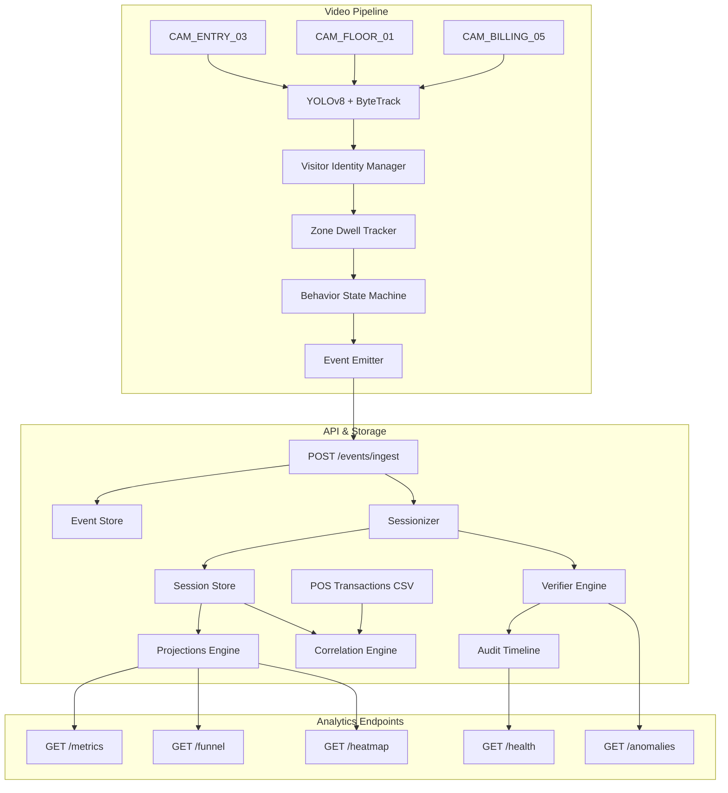

# System Architecture: Retail Intelligence Pipeline

This document provides a comprehensive overview of the design and architecture of the Apex Retail Intelligence system.

## 1. System Architecture Overview

The system processes multi-camera CCTV feeds, tracks visitor behavior in real time, correlates visual presence with POS transactions, detects anomalies, and provides queryable business intelligence via a FastAPI REST API and live dashboard.

### Key Stages
1. **Detection Layer (`pipeline/detect.py`)**:
   - Orchestrates frame extraction, YOLOv8 object detection, ByteTrack tracking, and appearance embedding extraction.
   - Leverages `VisitorIdentityManager` to resolve ephemeral track IDs into stable visitor identities.
2. **Event Stream**:
   - Emits structured, schema-compliant events (`ENTRY`, `EXIT`, `ZONE_ENTER`, `ZONE_EXIT`, `ZONE_DWELL`, `BILLING_QUEUE_JOIN`, `BILLING_QUEUE_ABANDON`, `REENTRY`) describing real-time visitor behaviors.
3. **Intelligence API (`app/main.py`)**:
   - Ingests events asynchronously and validates them against Pydantic schemas.
   - Deduplicates events using a memory-efficient cache keyed by `event_id`.
   - Feeds events into the `Sessionizer` to maintain active `VisitorSession` states.
4. **Projections Engine (`app/projections.py`)**:
   - Generates materialized projections for conversion funnels, visitor metrics, heatmaps, and anomalies.
   - Runs `VerifierEngine` hooks in real time to detect operational anomalies and feed issues.

---

## 2. Visitor Identity Persistence & Re-ID

A key challenge in retail tracking is maintaining identity persistence across camera handoffs, occlusions behind shelving units, and temporary exits.

### Two-Layer Identity System
- **Layer 1 (Ephemeral)**: `track_id` from ByteTrack, local to a single camera feed and subject to frequent churn due to occlusions.
- **Layer 2 (Stable)**: `visitor_id` from the `VisitorIdentityManager`. This represents a persistent visitor passport that survives occlusions and transitions across adjacent cameras.

### Identity Lifecycle States
- **ACTIVE**: The visitor is currently tracked on a camera frame.
- **SUSPENDED**: The visitor is lost but retained in a temporary pool. The duration of retention is determined adaptively based on the occlusion type (e.g., up to 60 seconds for store exits, 15 seconds for shelf occlusions).
- **EXPIRED**: The retention window elapsed. The passport is moved to the read-only archive to prevent identity hijacking.

### Hybrid Consensus Engine
To re-associate a suspended visitor with a new track, the system computes a composite score across multiple signals:
1. **Appearance Similarity**: Cosine similarity of OSNet embeddings.
2. **Temporal Proximity**: Decay function representing the time elapsed since the person was last seen.
3. **Store Geometry / Transition Probability**: Markov chain transition probabilities between cameras and zones based on physical adjacency.
4. **Track Health & Group Tracker**: Evaluates track reliability and group co-movement to boost association scores.
5. **Identity Courtroom**: An adversarial evaluation component that resolves ambiguous matches (e.g., if multiple candidates score highly) before committing to a merge.

---

## 3. AI-Assisted Decisions

During the system's design and implementation phases, several key architectural decisions were shaped by LLMs. Here we critique the AI recommendations and document our final choices:

### Decision 1: Consensus Engine Scoring System
- **LLM Suggestion**: The LLM proposed a simple weighted linear combination of appearance similarity and elapsed time to resolve Re-ID.
- **Critique & Override**: A simple linear sum was insufficient for dense store scenarios, leading to frequent false associations during group crossings. We overrode this by adding spatial transition plausibility (from the `StoreGraph` geometry) and implementing the **Identity Courtroom** model to arbitrate competing matches, reducing ID swaps.

### Decision 2: Occlusion Retention Window
- **LLM Suggestion**: The LLM recommended a static 30-second suspension window for all lost tracks.
- **Critique & Override**: A static window is highly suboptimal. If a customer exits the store and re-enters 45 seconds later, they are double-counted. If a customer is occluded by a clothes rack for 5 seconds, they might get a new ID if the threshold is too short. We implemented an adaptive **Occlusion Reasoner** that inspects the last bounding box position (e.g., near the entrance vs. in front of a shelf) and sets a context-specific `occlusion_retain_sec` (60s for exit, 15s for shelves).

### Decision 3: Real-Time Anomaly Verification
- **LLM Suggestion**: The LLM suggested running the `VerifierEngine` as an offline batch validation cron job or post-processing step.
- **Critique & Override**: Operational anomalies like queue depth spikes require immediate action. We integrated the `VerifierEngine` directly into the `Sessionizer` state mutation loop. Every time an inbound event is processed, the verifier runs event-level checks and generates warnings immediately, allowing the `/anomalies` endpoint to reflect store status in near real-time.
